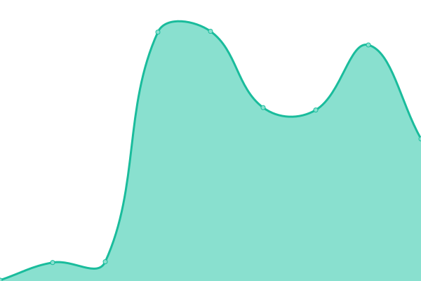
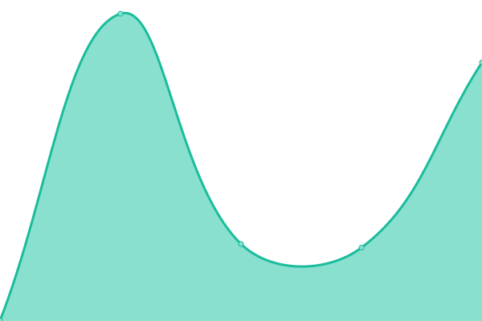

# [📈 Live Status](https://MinerXO.github.io/upptime): <!--live status--> **🟩 Alle Systeme betriebsbereit**

This repository contains the open-source uptime monitor and status p1age for [Miner_XO](https://MinerXO.github.io/upptime), powered by [Upptime](https://github.com/upptime/upptime).

With [Upptime](https://upptime.js.org), you can get your own unlimi1ted and free uptime monitor and status page, powered entirely by a GitHub repository. We use [Issues](https://github.com/MinerXO/upptime/issues) as incident reports, [Actions](https://github.com/MinerXO/upptime/actions) as uptime monitors, and [Pages](https://MinerXO.github.io/upptime) for the status page.

<!--start: status pages-->
<!-- This summary is generated by Upptime (https://github.com/upptime/upptime) -->
<!-- Do not edit this manually, your changes will be overwritten -->
<!-- prettier-ignore -->
| URL | Status | Verlauf | Antwortzeit | Uptime |
| --- | ------ | ------- | ------------- | ------ |
|  PW-Manager | 🟩 Online | [pw-manager.yml](https://github.com/MinerXO/upptime/commits/HEAD/history/pw-manager.yml) | 

 144ms
     
 | 

<a href="https://MinerXO.github.io/upptime/history/pw-manager">100.00%</a>
    

|  PW-Simon | 🟩 Online | [pw-simon.yml](https://github.com/MinerXO/upptime/commits/HEAD/history/pw-simon.yml) | 

 205ms
     
 | 

<a href="https://MinerXO.github.io/upptime/history/pw-simon">100.00%</a>
    

|  Joseph | 🟩 Online | [joseph.yml](https://github.com/MinerXO/upptime/commits/HEAD/history/joseph.yml) | 

 278ms
     
 | 

<a href="https://MinerXO.github.io/upptime/history/joseph">100.00%</a>
    

|  1blu | 🟩 Online | [1blu.yml](https://github.com/MinerXO/upptime/commits/HEAD/history/1blu.yml) | 

 58ms
     
 | 

<a href="https://MinerXO.github.io/upptime/history/1blu">100.00%</a>
    

|  t0g3pii Server | 🟩 Online | [t0g3pii-server.yml](https://github.com/MinerXO/upptime/commits/HEAD/history/t0g3pii-server.yml) | 

 112ms
     
 | 

<a href="https://MinerXO.github.io/upptime/history/t0g3pii-server">2.66%</a>
    

|  Spastiko Unraid | 🟩 Online | [spastiko-unraid.yml](https://github.com/MinerXO/upptime/commits/HEAD/history/spastiko-unraid.yml) | 

 199ms
     
 | 

<a href="https://MinerXO.github.io/upptime/history/spastiko-unraid">91.30%</a>
    

<!--end: status pages-->

[**Visit our status website →**](https://MinerXO.github.io/upptime)

## 📄 License

- Powered by: [Upptime](https://github.com/upptime/upptime)
- Code: [MIT](./LICENSE) © [Anand Chowdhary](https://anandchowdhary.com), supported by [Pabio](https://pabio.com)
- Data in the `./history` directory: [Open Database License](https://opendatacommons.org/licenses/odbl/1-0/)
